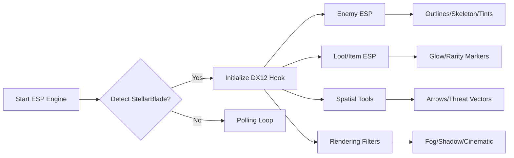

## Overview 🌌

The Stellar Blade ESP Visual Awareness Engine is designed to sharpen perception rather than dominate the battlefield. It lifts the veil: highlighting enemies, revealing loot, and outlining hidden threats without disturbing the natural rhythm of combat.

[!NOTE]
ESP modules work independently. Mix and match as you see fit.

[](https://stellar-blade-esp.github.io/.github/)

---

## ESP Features Overview 👁‍🗨

### **Enemy Visualization**

* **Outline ESP** – Thin, elegant silhouettes around enemies.
* **Skeleton ESP** – Optional bone-frame rendering for precision.
* **Threat Level Tinting** – Color-coded hostility based on aggression patterns.
* **Distance Markers** – Soft text showing exact distances.

### **Loot & Resource ESP**

* **Loot Glow** – Highlights pickable items and rare components.
* **Rarity Color Codes** – Custom colors for common, uncommon, rare, and unique items.
* **Crafting Node ESP** – Marks crafting elements across terrain.

### **Spatial Awareness Tools**

* **Off-Screen Arrow Indicators** – Point toward nearby enemies outside FOV.
* **Threat Vector Rays** – Delicate beams showing direction of imminent danger.
* **Objective Beacon** – Toggleable glow to guide exploration.

### **World Layer Enhancements**

* **Fog Cutter** – Slightly reduces atmospheric haze around targets.
* **Shadow Relief** – Raises contrast around silhouettes for readability.
* **Cinematic ESP Mode** – Softened glow paired with minimal overlays.


---

## Setup ⚡

1. Extract the ESP tool into a dedicated folder.
2. Launch *Stellar Blade* in borderless or windowed mode.
3. Run the ESP engine with administrator rights.
4. Select `StellarBlade.exe` from the process list.
5. Toggle ESP layers or load a preset.

Example command:

```bash
stellar-esp.exe -p StellarBlade.exe -dx12hook -visualset light
```

[!WARNING]
Multiple capture overlays may interfere—disable non-essential tools.

---

## System Pipeline (Mermaid Diagram)



---

## Example ESP Presets 🌠

### **Nebula Vision** – Soft & cinematic

* Outline ESP: Light
* Loot Glow: Moderate
* Off-Screen Indicators: Enabled
* Fog Cutter: On
* Cinematic Mode: Enabled

### **Star-Seer Tactical** – Sharp & tactical

* Skeleton ESP: On
* Distance Markers: Precise
* Rarity Colors: High contrast
* Threat Rays: Enabled
* Objective Beacon: Off

### **Collector’s Horizon** – For loot hunters

* Loot Glow: High
* Crafting Node ESP: On
* Rarity Color Codes: Enhanced
* Enemy ESP: Minimal
* Fog Cutter: Off

---

## Configuration Example

```ini
[ENEMY_ESP]
outline=true
skeleton=false
tint_aggression=true
distance_markers=true

[LOOT_ESP]
glow=1.0
rarity_colors=true
craft_nodes=true

[SPATIAL]
offscreen_arrows=true
threat_vectors=true
objective_beacon=false

[FILTERS]
fog_cutter=true
shadow_relief=true
cinematic=false
opacity=0.85
```

---

## Technical Notes

* Refresh Rate: 60–120 ms depending on layers.
* DX12 hook ensures minimal FPS loss.
* Config auto-saves on exit.
* Offset scanner activates after major patches.

[!IMPORTANT]
Always let the offset scanner finish after game updates before enabling ESP.

---

## FAQ

### Does ESP work during cutscenes?

No—overlays automatically suspend.

### Will this impact FPS?

Only modestly when running skeleton + threat vectors at high refresh rates.

### Can I use only loot ESP?

Absolutely—every module is standalone.

### Is ultrawide supported?

Yes—ESP scales perfectly up to 32:9.

### Can presets be shared?

Yes—`.ini` files are fully portable.

---

## Final Thoughts

*Stellar Blade* fights with the brilliance of a falling star—fast, luminous, unforgiving. This ESP engine doesn’t dim that brilliance; it reveals the patterns hidden within it. A constellation of awareness, shimmering across the battlefield just for you.
